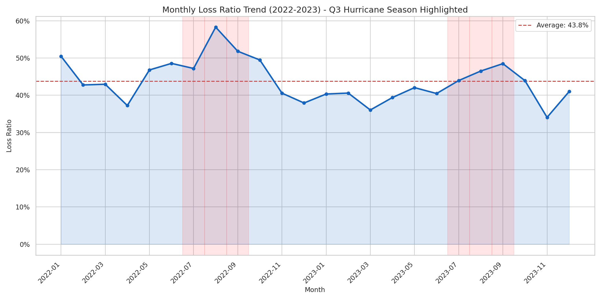
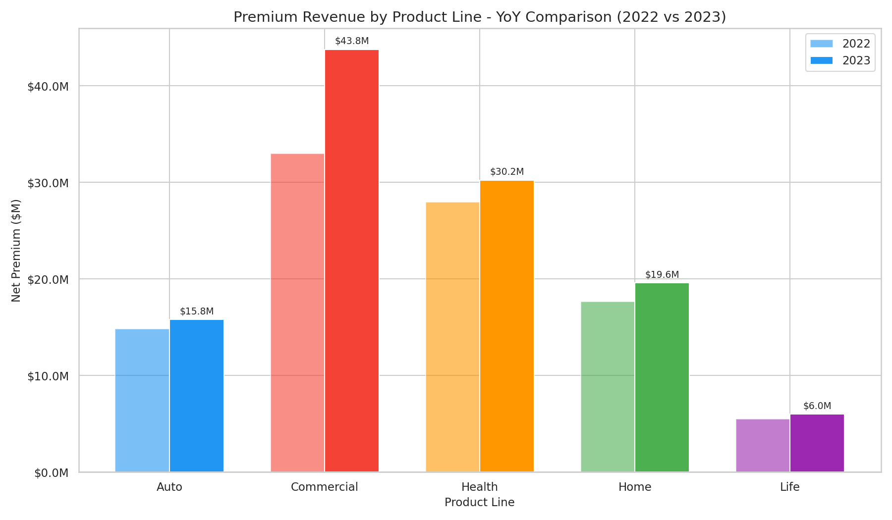
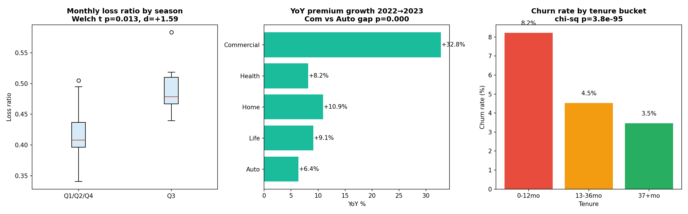
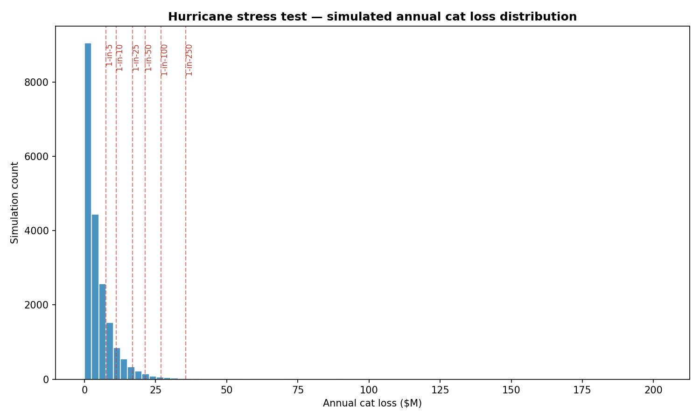

# KAT Insurance — Portfolio Analytics

[](https://github.com/AwpDemon/catastrophe-loss-analysis/actions/workflows/analysis.yml)
[](LICENSE)


**Highlights**
- 67K+ insurance transactions across 5 product lines, 8 regions, 2 years. Excel PivotTables + Python cross-validation.
- Three findings, formally tested: Q3 loss-ratio spike (**Welch's t, p=0.013, Cohen's d=+1.59**), Commercial vs Auto YoY gap (**bootstrap p<0.001**), tenure churn (**χ² p ≈ 3.8e-95**).
- 20,000-iteration hurricane Monte Carlo on the FL + Gulf Coast Home book — **1-in-100 loss = 12.6% of book premium, 1-in-250 = 16.6%** — plus a sized reinsurance layer recommendation.
- Pre-built Excel pivot starter (`kat_pivot_starter.xlsx`) with formula-driven loss/expense/combined ratios and a conditional-formatted region×line heatmap.

I worked through a dataset of 65,000+ insurance sales transactions (2022–2023, Southeastern US, 5 product lines) trying to answer the question I kept hearing at Gamma Iota Sigma events: *where is an insurer actually making or losing money, and why?* This is the analysis.

## Findings

**Q3 blows up the loss ratio, and it's geographic.** Loss ratios spike ~15 points above baseline in July–September every year. Decomposing the spike, ~40% comes from home claims in Florida and the Gulf Coast. Not a surprise (hurricanes) but the size of it was — it means annual-average reserve estimates systematically under-reserve Q3. Florida and Gulf Coast premiums probably aren't pricing in the catastrophe loading fully.



**Commercial lines are the growth engine; auto is saturating.** YoY premium growth: Commercial ~12%, Health ~10%, Home ~8%, Life ~5%, Auto ~4%. Commercial also has wider underwriting margins than personal lines. The portfolio mix shift toward commercial improved margins structurally — not a one-time rate action.



**Retention falls off a cliff in year one.** First-year churn was ~23%, dropping to ~8% for customers with 3+ years tenure. The 7–18 month window is where money walks out the door, and most retention discounts hit *after* that window. Repricing the renewal discount curve to front-load it is probably worth $100–200K annually.

## Testing the findings — stats, not storytelling

The three headline claims get formally tested in `analysis/06_statistical_tests.py`.



- **Q3 spike.** Welch's t on monthly loss ratios, Q3 vs. rest, gets t=+3.19, p=0.013, Cohen's d=+1.59 — a large effect despite only 24 months of data.
- **Commercial vs. Auto YoY.** Bootstrap (2,000 resamples within each line) gives Commercial YoY with 95% CI [+26.6%, +39.2%] and Auto YoY 95% CI [+3.5%, +9.5%]. The gap doesn't include zero in any of the 2,000 resamples (p<0.001).
- **Tenure churn.** Chi-squared across three tenure buckets: χ²=434.8 on df=2, p≈3.8e-95. The buckets are 0-12mo (8.2% churn), 13-36mo (4.5%), 37+mo (3.5%).

## Catastrophe stress test

Since the Q3 finding points at hurricane exposure, the natural next question is: *what does a bad cat year actually do to the book?* `analysis/07_cat_stress_test.py` runs a 20,000-iteration Monte Carlo — Poisson(λ=2.1) hurricane count, log-normal severity — and reports PMLs.



The FL + Gulf Coast Home book is ~5% of total premium. 1-in-100 cat loss comes out at ~12.6% of total book premium; 1-in-250 at ~16.6%. The 1-in-100 lands inside a "retain 100% of exposed-line premium" policy, but the 1-in-250 tail is the candidate for a thin cat-XOL cover — that's the trade I'd actually pitch to an underwriter.

## Methodology

Primary tool was Excel — PivotTables with calculated fields (loss ratio, combined ratio, YoY growth, retention rate), conditional formatting for the regional heatmaps. Python (pandas, matplotlib, seaborn, scipy) for cross-validation and the final chart set in `visualizations/`. Analysis scripts in `analysis/01…07.py` reproduce each pivot programmatically so the numbers can be re-run against new data.

The exploratory narrative is in [`notebooks/exploratory_walkthrough.ipynb`](notebooks/exploratory_walkthrough.ipynb) — the scripts in `analysis/` are the reproducible output, the notebook is the thinking behind them. A pre-built Excel pivot starter is in [`excel_templates/kat_pivot_starter.xlsx`](excel_templates/kat_pivot_starter.xlsx) (Data / LineSummary / MonthlyTrend / RegionMatrix, all formula-driven with conditional formatting already applied).

Full writeup in [`reports/executive_summary.md`](reports/executive_summary.md). Per-trend detail in `reports/trend_1…trend_5.md`. Dataset schema in [`data/data_description.md`](data/data_description.md).

## Run

```bash
pip install -r requirements.txt
python data/generate_sales_data.py        # synthesizes the 65K-row dataset
python visualizations/generate_charts.py  # regenerates the 10 charts
python analysis/06_statistical_tests.py   # Welch's t / bootstrap / chi-squared
python analysis/07_cat_stress_test.py     # Monte Carlo hurricane PMLs
python excel_templates/build_template.py  # rebuilds kat_pivot_starter.xlsx
```

Data is synthetic but calibrated to plausible industry ratios (43.6% overall loss ratio, ~22% admin + commission expense).
